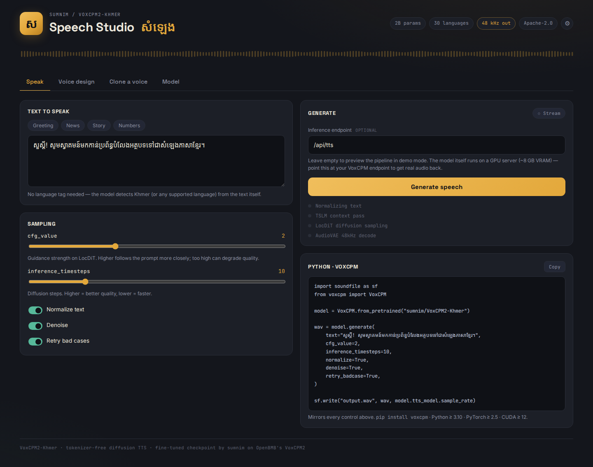
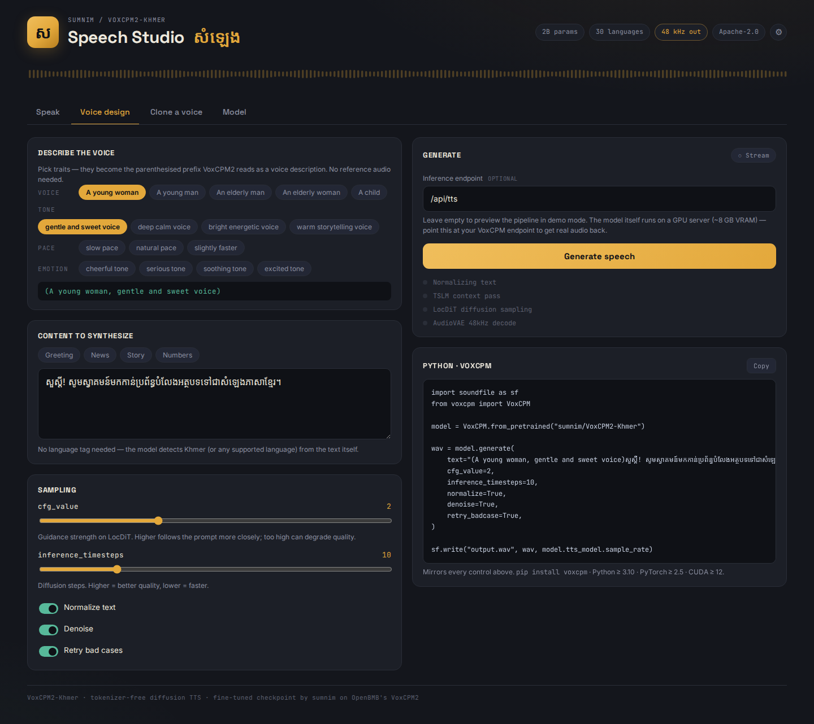
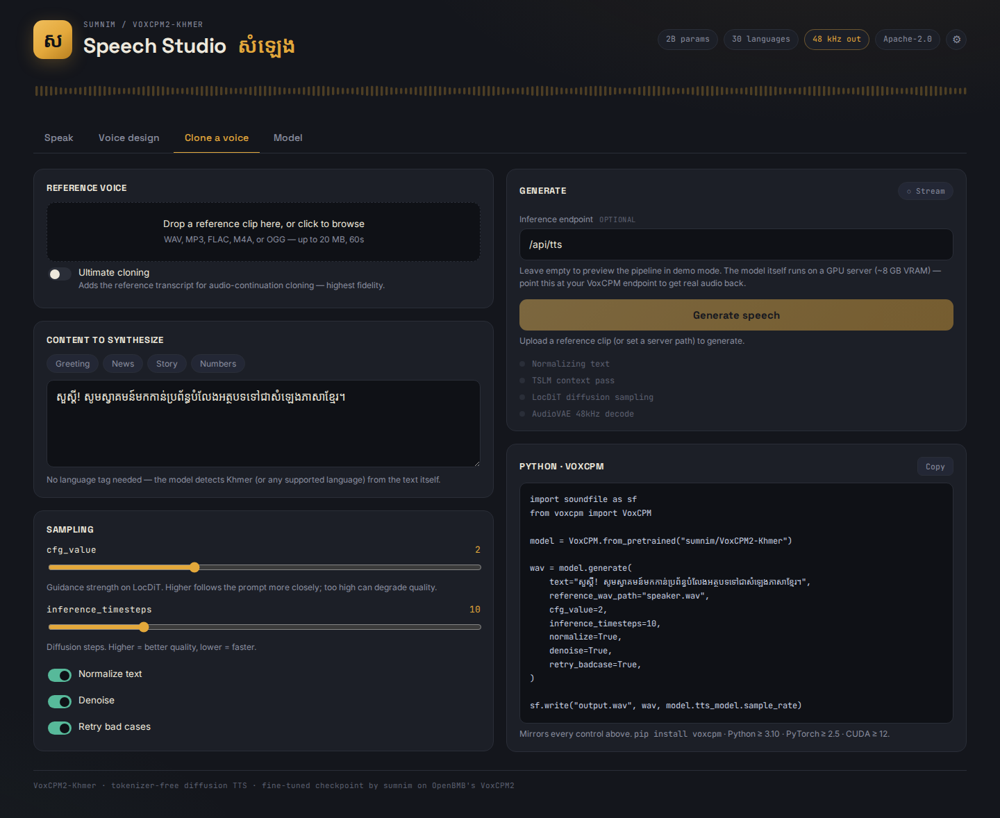
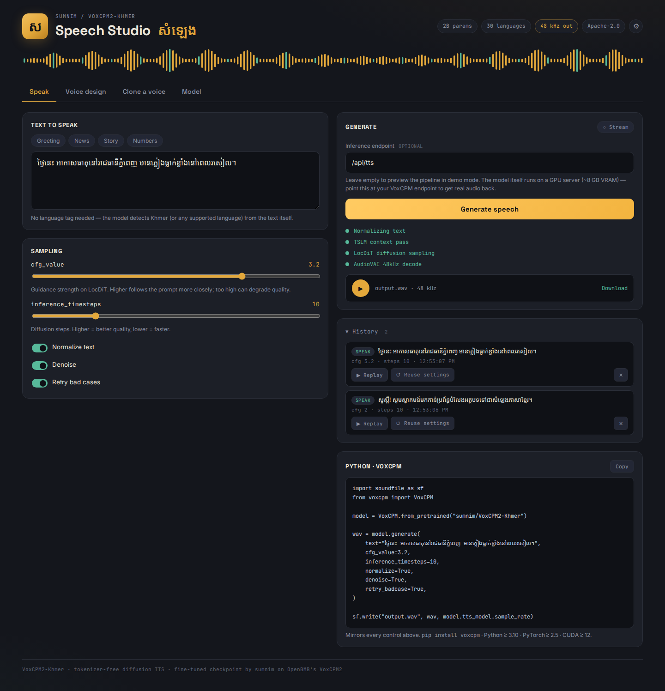

# VoxCPM2-Khmer · Speech Studio

**A production-ready web studio for Khmer text-to-speech**, built around
[sumnim/VoxCPM2-Khmer](https://huggingface.co/sumnim/VoxCPM2-Khmer) — a
Khmer-specialized fine-tune of OpenBMB's VoxCPM2 (2B params, tokenizer-free
diffusion AR, 30 languages, 48 kHz output).

[](https://huggingface.co/sumnim/VoxCPM2-Khmer)
[](backend/requirements.txt)
[](frontend/package.json)
[](https://github.com/lymakara-dev/voxcpm2-khmer-studio/actions/workflows/ci.yml)

<p align="center">
  
</p>

## Contents

- [Key features](#key-features)
- [Quick start (Docker)](#quick-start-docker)
- [Local development](#local-development)
- [Testing](#testing)
- [API reference](#api-reference)
- [Configuration](#configuration)
- [Responsible use](#responsible-use)

## Key features

| | |
|---|---|
| **Speak** — sample presets, `cfg_value` / `inference_timesteps` sliders, normalize / denoise / retry toggles, optional live streaming playback | **Voice design** — compose a voice from chip-based traits (voice, tone, pace, emotion) with no reference audio needed |
|  |  |
| **Clone a voice** — drag-and-drop reference upload (auto-converted to 16 kHz mono), plus "ultimate" cloning with a reference transcript | **History** — the last 10 generations with one-click replay and "reuse settings" to restore every control from a past run |
|  |  |

Every control mirrors 1:1 into a ready-to-run Python snippet (right-hand panel above),
and the whole pipeline is visualized as it runs — normalize → TSLM context → LocDiT
diffusion → AudioVAE decode.

Backend: FastAPI with request validation, a bounded FIFO job queue (fair GPU
scheduling instead of 429-on-busy), optional API-key auth, sliding-window rate
limiting, and a `MOCK_TTS=1` mode that returns synthetic audio for GPU-less
dev/CI.

## Quick start (Docker)

Requires an NVIDIA GPU (~8 GB VRAM) and the NVIDIA Container Toolkit.

```bash
docker compose up --build
# first start downloads the 2B checkpoint into the hf-cache volume
```

Open http://localhost:8080

## Local development

```bash
# terminal 1 — API on :8000
cd backend
pip install -r requirements.txt
uvicorn app.main:app --reload
# no GPU? set MOCK_TTS=1 to skip loading the real model and get a synthetic
# sine-wave clip back instead — same API shape, useful for frontend dev/CI.

# terminal 2 — UI on :5173 (proxies /api to :8000)
cd frontend
npm install
npm run dev
```

## Testing

Everything runs without a GPU — the backend suite forces `MOCK_TTS=1` and the
frontend suite mocks the API entirely via Playwright route interception.

```bash
make test-backend   # pytest — health/model-info, tts, upload, job queue, auth, rate limits
make test-frontend   # vite build + Playwright smoke test
make test            # both
```

`backend/requirements-dev.txt` deliberately skips `voxcpm` (and its torch
dependency chain) from `requirements.txt` — the suite runs under `MOCK_TTS=1`,
where the real model is never imported, so installing it would only slow CI
down for no benefit.

`.github/workflows/ci.yml` runs both suites on every push and pull request.

## API reference

| Endpoint | Purpose |
|---|---|
| `POST /api/tts` | Synthesize speech → `audio/wav` (or `{job_id}` with `?async=1`) |
| `POST /api/tts-stream` | Synthesize speech → chunked raw 16-bit PCM |
| `POST /api/upload-ref` | Upload reference audio → `{ref_id}` |
| `GET /api/jobs/{id}` | Job status + queue position |
| `GET /api/jobs/{id}/result` | Finished job's `audio/wav` |
| `GET /api/health` | Liveness + model status (always open) |
| `GET /api/model-info` | Static model metadata + feature flags (always open) |

All error responses are `{"detail": "<human-readable message>"}` — the
frontend shows `detail` verbatim, so backend errors are written for end
users, not developers.

<details>
<summary><strong><code>POST /api/tts</code></strong> → <code>audio/wav</code></summary>

```json
{
  "text": "សួស្តី! សូមស្វាគមន៍",
  "cfg_value": 2.0,
  "inference_timesteps": 10,
  "normalize": true,
  "denoise": true,
  "retry_badcase": true,
  "reference_wav_path": null,
  "prompt_wav_path": null,
  "prompt_text": null,
  "reference_ref_id": null,
  "prompt_ref_id": null
}
```

`reference_ref_id` / `prompt_ref_id` are ids returned by `POST /api/upload-ref`
and are the recommended way to pass reference audio. `reference_wav_path` /
`prompt_wav_path` (raw server-side paths) only work when the server has
`ALLOW_RAW_PATHS=1` set — disabled by default because a client-supplied path
lets anyone read any file the server process can see.

Requests are handled by a bounded FIFO queue (`MAX_QUEUE`, default 10) with a
single worker, so GPU access is serialized fairly instead of rejecting
concurrent requests outright. By default `/api/tts` enqueues the job and
waits for it, so this behaves exactly like a plain request in, a wav out.
Pass `?async=1` to get `{"job_id": ..., "position": N}` back immediately
instead of waiting:

- `GET /api/jobs/{id}` → `{"status": "queued" | "running" | "done" | "failed" | "expired", "position": N, "error"?: "..."}`
  (`position` is 1-based while queued, 0 once running or finished)
- `GET /api/jobs/{id}/result` → the `audio/wav` once `status` is `done` (409
  while still processing, 500 if `failed`, 410 once the job has passed
  `JOB_TTL_MIN` and expired)

429 (`{"detail": "The synthesis queue is full — try again shortly."}`) only
happens once `MAX_QUEUE` requests are already waiting — not on every
concurrent request.

</details>

<details>
<summary><strong><code>POST /api/upload-ref</code></strong> → reference-audio upload</summary>

Multipart form with a `file` field (WAV, MP3, FLAC, M4A, or OGG; ≤ 20 MB;
≤ 60s). The server converts it to 16 kHz mono WAV, stores it under
`UPLOAD_DIR` with a UUID name, and deletes it after `UPLOAD_TTL_HOURS`
(default 24h).

```json
{ "ref_id": "5f2c...", "duration_s": 4.2, "filename": "speaker.wav" }
```

Use `ref_id` as `reference_ref_id` / `prompt_ref_id` in a subsequent
`/api/tts` call.

</details>

<details>
<summary><strong><code>POST /api/tts-stream</code></strong> → chunked <code>audio/pcm;rate=48000</code></summary>

Same request body as `/api/tts`. Instead of a WAV file, the response is
chunked raw **16-bit little-endian PCM, mono**, at the rate given in the
`X-Sample-Rate` header — a WAV container needs the total byte length up
front, which isn't available while streaming. The frontend decodes each
chunk into a Web Audio `AudioBuffer` and schedules it for playback as it
arrives, so audio starts before generation finishes; once the stream ends,
the accumulated PCM is wrapped into a WAV blob client-side so downloading
still works. Returns 429 (same `detail` shape as `/api/tts`) if a synthesis
is already in progress.

</details>

<details>
<summary><strong><code>GET /api/health</code></strong> · <strong><code>GET /api/model-info</code></strong></summary>

`model-info` includes `allow_raw_paths`, `mock`, and `auth_required` so the
frontend can adapt its UI (raw-path field, mock badge, whether to prompt for
an API key). Both routes are always open — no API key needed even when
`API_KEYS` is set.

</details>

<details>
<summary><strong>Auth + rate limiting</strong></summary>

Every route above except `/api/health` and `/api/model-info` is gated by
`API_KEYS`: unset (the default) disables auth entirely; set it to a
comma-separated list of keys and those routes require
`Authorization: Bearer <key>` or `X-API-Key: <key>`, returning 401
otherwise.

Every caller — identified by API key when auth is on, by client IP when it's
off — is also sliding-window rate limited:

- `RATE_LIMIT_PER_MIN` (default 10) requests per minute
- `RATE_LIMIT_CHARS_PER_HOUR` (default 20000) characters of `text` per hour,
  on `/api/tts` and `/api/tts-stream` only, since cost scales with text
  length

Both return 429 with a `Retry-After` header (seconds) once exceeded. The
limiter (`app/auth.py::SlidingWindowLimiter`) is in-memory and per-process;
swap it for a Redis-backed implementation to share limits across multiple
replicas.

</details>

## Configuration

All backend configuration is environment variables, read once at import time
in `backend/app/config.py` (see `backend/.env.example`).

| Variable | Default | Purpose |
|---|---|---|
| `MODEL_ID` | `sumnim/VoxCPM2-Khmer` | Hugging Face model id to load |
| `LAZY_LOAD` | `0` | Load the model on first request instead of at startup |
| `MOCK_TTS` | `0` | Skip loading the real model; return synthetic sine-wave audio |
| `MAX_TEXT_CHARS` | `2000` | Max characters accepted in `text` |
| `ALLOWED_ORIGINS` | `*` | Comma-separated CORS origins |
| `UPLOAD_DIR` | `/tmp/voxcpm-refs` | Storage path for uploaded reference clips |
| `UPLOAD_MAX_MB` | `20` | Max upload size |
| `UPLOAD_MAX_DURATION_S` | `60` | Max reference clip duration |
| `UPLOAD_TTL_HOURS` | `24` | Delete uploads older than this |
| `ALLOW_RAW_PATHS` | `0` | Allow client-supplied server file paths (single-user deployments only) |
| `MAX_QUEUE` | `10` | Max jobs waiting in the synthesis queue |
| `JOB_TTL_MIN` | `15` | How long a finished job's result stays fetchable |
| `API_KEYS` | *(unset)* | Comma-separated keys; unset disables auth entirely |
| `RATE_LIMIT_PER_MIN` | `10` | Requests per minute per caller |
| `RATE_LIMIT_CHARS_PER_HOUR` | `20000` | `text` characters per hour per caller |

## Responsible use

The model license forbids impersonation, fraud, and disinformation.
Label AI-generated speech clearly and get consent before cloning voices.
